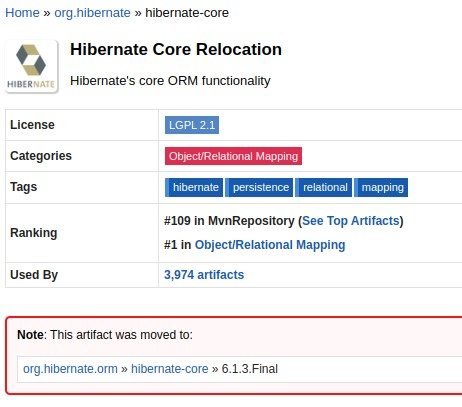
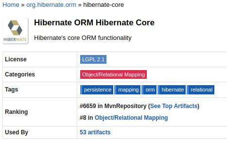

Spring Boot2 con Hibernate 6
---------------------------

Este es el proyecto padre de un conjunto de submodulos que pretenden servir de ejemplo para las diversas formas de configurar y utilizar hibernate.

Las tecnologias usadas
~~~~~~~~~~~~~~~~~~~~~~
* Spring Boot 2 - version 2.7.4
* Hibernate- version 6.1.3 Final
* Base de datos H2 - version 2.1.214

Notas generales
~~~~~~~~~~~~~~~~
* Tener un proyecto padre y luego submodulos ha dado lugar a una duda: *Es lo mismo un modulo de maven que un modulo de Java?* 
+
Aparentemente no son lo mismo. En eclipse es posible crear un submodulo de maven mediante un wizard. Los modulos, dependiendo de la vista usada, pueden verse como modulos anidados (Project explorer view) o como proyectos independientes (Package Explorer). Un modulo Java no tiene nada que ver con un modulo maven, y por lo que he podido ver, en Eclipse no hay un wizar que permita una rapida creacion de modulos de Java. En eclipse tendria que investigarlo.

* Tener un proyecto maven padre y uno o mas proyectos maven hijos trae como consecuencia que en el pom de un proyecto anidado no se pueda tener como *parent a spring-boot-starter-parent* ya  que necesitamos tener como parent a nuestro pom.xml del proyecto padre o raiz, es decir, el proyecto *hb*.
+
Para conseguir esto es necesario inlcuir en el submodulo las dependencias de *spring-boot-starter-parent* como dependencias gestionadas (*</dependencyManagement>*), ademas de otras consideraciones que se pueden ver el el README.adoc 

* Spring Boot 2 *ya no soporta versiones de Java 7 ni anteriores*. Funcionara a partir de *Java 8*. NO existen planes para que Spring Boot 1.x tenga soporte para versiones de Java 9. *https://www.baeldung.com/new-spring-boot-2[Baeldung^]*.

* *https://dzone.com/articles/spring-boot-20-new-features-infrastructure-changes[Para conmsultar un resumen de las nuevas caracteristicas de Spring Boot 2]*.

* Dependencias de hibernate *org.hiberbate* o *org.hibernate.orm*?? El artefacto ha sido movido de *org.hibernate* a *org.hibernate.orm*:
+

+
La dependencia ahora es org.hibernate.orm:
+

+
con ello han cambiado el xml de cada version. La version anterior es:
+
[source,python]
-----------------
<dependency>
    <groupId>org.hibernate</groupId>
    <artifactId>hibernate-core</artifactId>
    <version>6.1.3.Final</version>
    <type>pom</type>
</dependency>
-----------------
+
La version nueva es: 
+
[source,python]
-----------------
<dependency>
    <groupId>org.hibernate.orm</groupId>
    <artifactId>hibernate-core</artifactId>
    <version>6.1.3.Final</version>
</dependency>
-----------------

* Con la nueva version de Spring Boot 2 muchas de sus dependencias han sido actualizadas. Dichas versiones pueden verse en *https://github.com/spring-projects/spring-boot/blob/2.0.x/spring-boot-project/spring-boot-dependencies/pom.xml[Spring Boot Dependencies^]*
+
Con estas actualizaciones hibernate funciona solo desde la version *5.2*. Sin embargo, no funciona con las versiones de *Hibernet 6.x*

* *Spring Boot 2* al soportar Hibernate 5.x importa todas las librerias necesarias de la especificacion *JavaEE* para poder funcionar. *Hibernate 6.x* funciona con las librerias provenientes de la especificacion *JakartaEE* Esto da lugar a importantes incompatibilidades que hay que gestionar. README.adoc. El siguiente articulo lo explica con bastante claridad:
+
*https://stackoverflow.com/questions/73257636/using-hibernate-6-x-with-spring-boot-2-7-x-not-working[(Using Hibernate 6.x with Spring Boot 2.7.x not working?)^]*
+
*Basicamente dice:*
+
"Hibernate 6 uses the JPA version (JPA 3) that uses the jakarta.persistence package names introduced in JakartaEE 9. Spring Boot still uses the javax.* package namespace of JakartaEE 8 and earlier (JPA 2.2 and earlier), and thus only supports Hibernate 5.x (for Spring Boot 2.7, Hibernate 5.6.x is the default).
+
You will need to wait for Spring Boot 3, which switches to the jakarta.* packages of JakartaEE 9+, before you can use Hibernate 6. Until that time, you'll need to use Hibernate 5.6.".
+
Hay planes para sacar una version de *Spring Boot 3 en Noviembre 2023*

* *Spring Boot Devtools* no es compatible con *Hibernate 5.x.* En delante, tal como se puede apreciar en estos  articulos:
+
*https://www.programmersought.com/article/24053413916/[(HHH000122: IllegalArgumentException)^]*
+
*https://stackoverflow.com/questions/28957085/hhh000122-illegalargumentexception-in-class-consumeragentaccount-getter-metho[(StackOverflow)^]*
+
*https://stackoverflow.com/questions/35416308/class-loading-error-with-spring-boot-and-hibernate-5[(Class loading error with Spring Boot and Hibernate 5)^]*

* *Nota sobre la version de Java en el Pom.* A pesar de estar trabajando con una version de Java 11, la definicion de la version de java mediante:
+
[source,xml]
------------
<properties>
    <maven.compiler.release>11</maven.compiler.release>
</properties>
------------

+
 No ha funcionado!. Ni con *maven-compiler-plugin* ni con *spring-boot-maven-plugin*. Las unicas configuraciones que han funcionado han sido:
. *maven-compiler-plugin*: 
+
[source,xml] 
-------------
<properties>
	<java.version>11</java.version>
</properties>
------------------------------
. *spring-boot-maven-plugin*:
+
[source,xml] 
-------------
<properties>
	<maven.compiler.target>11</maven.compiler.target>
	<maven.compiler.source>11</maven.compiler.source>
</properties>
-----------------	

