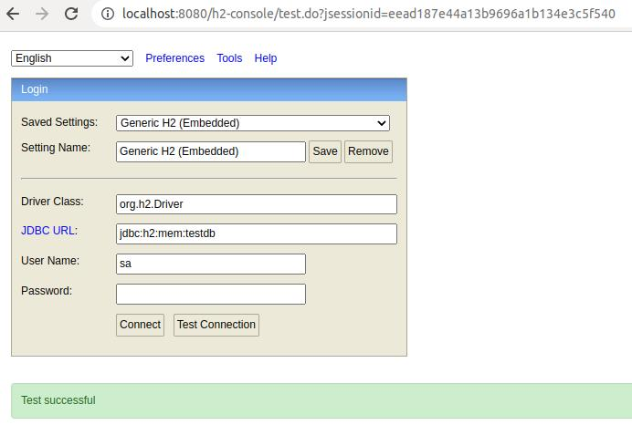

Spring MVC con Hibernate 6.3.1
------------------------------

Este proyecto tiene como objetivo la configuracion de un proyecto hibernate con las siguientes tecnologias:

* Spring Boot 2 - version 2.7.4
* Hibernate- version 6.1.3 Final
* Base de datos H2 - version 2.1.214

En particular se pretende configurar Hibernate usando:

* Fichero hibernate.cfg.xml
* Fichero Student.hbm.xml

Estructura basica del proyecto
~~~~~~~~~~~~~~~~~~~~~~~~~~~~~~~

El proyecto es un sub-modulo de maven que forma parte de un proyecto maven padre *(hb)*. Esto implica ciertas consideraciones que hay que tomar en la configuracion de los proyectos.

Notas generales del submodulo
~~~~~~~~~~~~~~~~~~~~~~~~~~~~~

* El parent del submodulo no es *spring-boot-starter-parent*, ya que su pom.xml padre es *com.hibernate.samples* que es el proyecto padre. Las dependencias parent de Spring deben incluirse como *dependencias gestionadas* asi:
+
[source,xml]
----------------
	<dependencyManagement>
			<dependency>
				<groupId>org.springframework.boot</groupId>
				<artifactId>spring-boot-dependencies</artifactId>
				<version>2.7.4</version>
				<type>pom</type>
				<scope>import</scope>
			</dependency>
		</dependencies>
	</dependencyManagement>
------------------	
* Derivado del uso, por parte de *Hibernate 6.x*, de la especificacion JakartaEE, es necesario *importar* todas las nuevas dependencias de para el correcto funcionamiento de Hibernate 6 dentro de *<dependencyManagement>*, asi:
+
[source,xml]
----------------
	<dependencyManagement>
		<dependencies>
			<dependency>
				<groupId>jakarta.persistence</groupId>
				<artifactId>jakarta.persistence-api</artifactId>
				<version>3.1.0</version>
			</dependency>

			<dependency>
				<groupId>jakarta.transaction</groupId>
				<artifactId>jakarta.transaction-api</artifactId>
				<version>2.0.1</version>
			</dependency>

			<dependency>
				<groupId>jakarta.xml.bind</groupId>
				<artifactId>jakarta.xml.bind-api</artifactId>
				<version>4.0.0</version>
			</dependency>

			<dependency>
				<groupId>org.glassfish.jaxb</groupId>
				<artifactId>jaxb-runtime</artifactId>
				<version>4.0.0</version>
			</dependency>

			<dependency>
				<groupId>jakarta.activation</groupId>
				<artifactId>jakarta.activation-api</artifactId>
				<version>2.1.0</version>
			</dependency>

			<dependency>
				<groupId>org.springframework.boot</groupId>
				<artifactId>spring-boot-dependencies</artifactId>
				<version>2.7.4</version>
				<type>pom</type>
				<scope>import</scope>
			</dependency>
		</dependencies>
	</dependencyManagement>
----------------

* El resto de dependencias pueden incluirse normalmente dentro de *<dependency></dependency>*
* *Spring Devtools* es preferible no usarlo ya que generara varios problemas:
. Lanzamiento de excepciones no chequeadas durante depuracion que generan puntos de ruptura "fantasma" *SilentExitExceptionHandler.class, en el metodo exitCurrentThread()*. Para solucionar este error es necesario instalar desde el *Marketplace* el Spring Tools para eclipse. Mas informacion en:
+
*https://stackoverflow.com/questions/32770884/breakpoint-at-throw-new-silentexitexception-in-eclipse-spring-boot[SilentException]*
+
*https://github.com/spring-projects/spring-boot/issues/3100[issue 3100]*
. Al instalar el Spring Tools de Eclipse *rompe* el editor de *ficheros POM.xml* ya que genera algun tipo de conflicto con el paquete *org.eclipse.tm4e*:
+
*https://stackoverflow.com/questions/72043028/spring-plugin-in-eclipse-cannot-open-pom-xml[no se puede abrir los ficheros pom.xml]*
+
Para solucionarlo hay que ir a: Help → Install new software → Add URL: https://download.eclipse.org/tm4e/snapshots/. Click finish. Restart Eclipse 
+
Yo tuve que seleccionar todas las dependencias que aparecian disponibles en esa URL
. Finalmente, luego de instalar de Spring Boot Devtools y el Spring Tool para Eclipse terminamos teniendo un error ocacionado por *incompatibilidad entre Spring Devtools e Hibernate 6*. El error es el siguiente:
+
**HHH000122: IllegalArgumentException in class: com.hibernate.sample.entities.Student, getter method of property: id**
+
Y la traza es:
+
[source,txt]
--------------------
HHH000122: IllegalArgumentException in class: com.hibernate.sample.entities.Student, getter method of property: id
2022-10-05 06:38:15.664  INFO 89747 --- [  restartedMain] ConditionEvaluationReportLoggingListener : 

Error starting ApplicationContext. To display the conditions report re-run your application with 'debug' enabled.
2022-10-05 06:38:15.690 ERROR 89747 --- [  restartedMain] o.s.boot.SpringApplication               : Application run failed

java.lang.IllegalStateException: Failed to execute CommandLineRunner
	at org.springframework.boot.SpringApplication.callRunner(SpringApplication.java:774) ~[spring-boot-2.7.4.jar:2.7.4]
	at org.springframework.boot.SpringApplication.callRunners(SpringApplication.java:755) ~[spring-boot-2.7.4.jar:2.7.4]
	at org.springframework.boot.SpringApplication.run(SpringApplication.java:315) ~[spring-boot-2.7.4.jar:2.7.4]
	at org.springframework.boot.SpringApplication.run(SpringApplication.java:1306) ~[spring-boot-2.7.4.jar:2.7.4]
	at org.springframework.boot.SpringApplication.run(SpringApplication.java:1295) ~[spring-boot-2.7.4.jar:2.7.4]
	at com.hibernate.sample.App.main(App.java:15) ~[classes/:na]
	at java.base/jdk.internal.reflect.DirectMethodHandleAccessor.invoke(DirectMethodHandleAccessor.java:104) ~[na:na]
	at java.base/java.lang.reflect.Method.invoke(Method.java:577) ~[na:na]
	at org.springframework.boot.devtools.restart.RestartLauncher.run(RestartLauncher.java:49) ~[spring-boot-devtools-2.7.4.jar:2.7.4]
Caused by: jakarta.persistence.PersistenceException: Converting `org.hibernate.PropertyAccessException` to JPA `PersistenceException` : IllegalArgumentException occurred calling : `com.hibernate.sample.entities.Student.id` (getter)
	at org.hibernate.internal.ExceptionConverterImpl.convert(ExceptionConverterImpl.java:165) ~[hibernate-core-6.1.3.Final.jar:6.1.3.Final]
	at org.hibernate.internal.ExceptionConverterImpl.convert(ExceptionConverterImpl.java:175) ~[hibernate-core-6.1.3.Final.jar:6.1.3.Final]
	at org.hibernate.internal.ExceptionConverterImpl.convert(ExceptionConverterImpl.java:182) ~[hibernate-core-6.1.3.Final.jar:6.1.3.Final]
	at org.hibernate.internal.SessionImpl.firePersist(SessionImpl.java:741) ~[hibernate-core-6.1.3.Final.jar:6.1.3.Final]
	at org.hibernate.internal.SessionImpl.persist(SessionImpl.java:719) ~[hibernate-core-6.1.3.Final.jar:6.1.3.Final]
	at com.hibernate.sample.config.Database.lambda$0(Database.java:33) ~[classes/:na]
	at org.springframework.boot.SpringApplication.callRunner(SpringApplication.java:771) ~[spring-boot-2.7.4.jar:2.7.4]
	... 8 common frames omitted
Caused by: org.hibernate.PropertyAccessException: IllegalArgumentException occurred calling : `com.hibernate.sample.entities.Student.id` (getter)
	at org.hibernate.property.access.spi.GetterMethodImpl.get(GetterMethodImpl.java:67) ~[hibernate-core-6.1.3.Final.jar:6.1.3.Final]
	at org.hibernate.metamodel.mapping.internal.BasicEntityIdentifierMappingImpl.getIdentifier(BasicEntityIdentifierMappingImpl.java:144) ~[hibernate-core-6.1.3.Final.jar:6.1.3.Final]
	at org.hibernate.persister.entity.AbstractEntityPersister.getIdentifier(AbstractEntityPersister.java:5199) ~[hibernate-core-6.1.3.Final.jar:6.1.3.Final]
	at org.hibernate.persister.entity.AbstractEntityPersister.isTransient(AbstractEntityPersister.java:4768) ~[hibernate-core-6.1.3.Final.jar:6.1.3.Final]
	at org.hibernate.engine.internal.ForeignKeys.isTransient(ForeignKeys.java:291) ~[hibernate-core-6.1.3.Final.jar:6.1.3.Final]
	at org.hibernate.event.internal.EntityState.getEntityState(EntityState.java:59) ~[hibernate-core-6.1.3.Final.jar:6.1.3.Final]
	at org.hibernate.event.internal.DefaultPersistEventListener.onPersist(DefaultPersistEventListener.java:93) ~[hibernate-core-6.1.3.Final.jar:6.1.3.Final]
	at org.hibernate.event.internal.DefaultPersistEventListener.onPersist(DefaultPersistEventListener.java:53) ~[hibernate-core-6.1.3.Final.jar:6.1.3.Final]
	at org.hibernate.event.service.internal.EventListenerGroupImpl.fireEventOnEachListener(EventListenerGroupImpl.java:107) ~[hibernate-core-6.1.3.Final.jar:6.1.3.Final]
	at org.hibernate.internal.SessionImpl.firePersist(SessionImpl.java:735) ~[hibernate-core-6.1.3.Final.jar:6.1.3.Final]
	... 11 common frames omitted
Caused by: java.lang.IllegalArgumentException: object is not an instance of declaring class
	at java.base/jdk.internal.reflect.DirectMethodHandleAccessor.checkReceiver(DirectMethodHandleAccessor.java:202) ~[na:na]
	at java.base/jdk.internal.reflect.DirectMethodHandleAccessor.invoke(DirectMethodHandleAccessor.java:100) ~[na:na]
	at java.base/java.lang.reflect.Method.invoke(Method.java:577) ~[na:na]
	at org.hibernate.property.access.spi.GetterMethodImpl.get(GetterMethodImpl.java:44) ~[hibernate-core-6.1.3.Final.jar:6.1.3.Final]
	... 20 common frames omitted
	
--------------------
*La solucion finalmente es no haber instalado desde el principio el Spring Boot Devtools* Mas informacion en los siguientes enlaces:
- https://www.programmersought.com/article/24053413916/
- https://stackoverflow.com/questions/35416308/class-loading-error-with-spring-boot-and-hibernate-5
- https://github.com/spring-projects/spring-boot/issues/2763

Notas sobre la configuracion del submodulo hbmfile
~~~~~~~~~~~~~~~~~~~~~~~~~~~~~~~~~~~~~~~~~~~~~~~~~~
* La documentacion oficial esta en *https://docs.jboss.org/hibernate/orm/current/userguide/html_single/Hibernate_User_Guide.html#_system_requirements[Hibernate ORM 6.1.3.Final User Guide^]*
* La documentacion oficial deriva a los desarrolladores principiantes hacia *https://docs.jboss.org/hibernate/orm/6.1/quickstart/html_single/#hibernate-gsg-tutorial-basic-config[Hibernate Getting Started Guide^]*. Esta guia, muestra ejemplos muy concretos basados en test unitarios que demuestran como configurar y ejecutar hibernate 6. *https://docs.jboss.org/hibernate/orm/6.1/quickstart/html_single/hibernate-tutorials.zip[Codigo fuente de los ejemlos de Hibernate 6]*
* *https://docs.jboss.org/hibernate/orm/6.1/javadocs/[JavaDoc de Hibernate]*
* En este ejemplo contreto usamos los *ficheros xml* para configurar Hibernate.
* En relacion a la base de datos *H2* es necesario decir, que al incluir la dependencia en el POM y al configurar hibernate con las parametros iniciales, es hibernate el que arranca un servidor nuevo de la base de datos.
* Para abrir la *consola de H2* hay que anadir un parametro al fichero de *aplication.properties*:
+
[source,properties]
-------------
spring.h2.console.enabled=true
-------------
* Para acceder a la consola introducimos la url: *http://localhost:8080/h2-console/*. Aparecera una interfaz:
+

+
hay que tener cuidado con los parametros introducidos, tales como usuario, es *sa* no 'as'. La url de conexion es *jdbc:h2:mem:testdb* no 'jdbc:h2:~/test' al menos en este caso que es una BD en memoria. Finalmente tener cuidado con el dirver *org.h2.Driver*

Si todo esta bien configurado hibernate funcionara con Spring Boot
------------------------------------------------------------------

